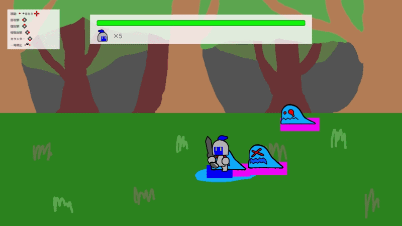

# 勇者の卵


## 概要
2Dベルトアクション。文化祭展示用で1プレイ10分程度に収まるようにしています。
4つのアクションを駆使してモンスターの群れを撃破しよう。
* 弱攻撃：隙が少ない3段攻撃です。
* 強攻撃：リーチと攻撃力に優れた3段攻撃です。
* 特殊攻撃：溜めを行った後、竜巻を起こし周囲に多段攻撃を行います。溜め動作から後隙まで敵の攻撃でよろけません。また、攻撃中は移動が可能です。
* カウンター：構え中に敵の攻撃を受けると攻撃を行います。攻撃中はダメージを受けません。

## 開発環境
### 体制
個人制作
### ゲームエンジン
Unity2021.3.2f1
### 言語
C#

## 工夫した点
* 敵の攻撃予測範囲と攻撃範囲を可視化しました。2Dベルトアクションは2Dでありながら奥行きがあるため、見た目通りでない当たり判定になってしまいます。これはプレイのストレスに繋がるため実装しました。
  敵に攻撃予測範囲、攻撃オブジェクトに攻撃範囲を表示するオブジェクトを持たせました。敵のアニメーションから攻撃予備動作開始、攻撃モーション開始のイベントを呼ぶことで表示切替を行っています。
* 簡単な音量設定機能を実装しました。文化祭展示中はお客様はPCの設定を操作することができないため、ゲーム内で変更できるようにしました。
  GameManagerにSE用とBGM用の2つのAudioSourceを子として持たせ、UI操作を介してボリュームを操作しすることで実装しました。
  GameManagerはシングルトンであり、シーンをまたいでも破棄されません。全てのシーンで音量設定を保持します。
* 簡単な一時停止、再開を実装しました。お子様連れのお客様が交代でプレイすることもあったので実装しました。
  TimeScaleを操作することで実装しました。アニメーションや物理挙動等アクションに関わるものは全て影響を受けるため、一時停止中にダメージを受けるといった理不尽は起きなくなっています。
* 一時停止ウィンドウを介してリスタート、リタイアできるようにしました。ステージ間違えの修正、ノーダメージチャレンジのリテイク、ゲームが合わなかった時の中断といった役割があります。
* ダメージを受けるオブジェクトが共通で持つインターフェース「IDamageable」を実装しました。攻撃側は攻撃を受けたオブジェクトのDamage(int)を呼び、ダメージを与えます。共通仕様により役割を明確にしました。
* Y座標が大きくなるほど奥にあるように見せる処理を実装しました。見た目を自然にするためです。Y座標に応じてキャラクターのSpriteRendererのSorting Layerを変更するようにしました。
* 敵は価値関数を通して移動方向と攻撃の決定を行います。敵は攻撃を連続して行わず、攻撃と移動を繰り返します。移動開始前には移動方向を、攻撃前には攻撃手段を決定します。敵ごとに行動に傾向を持たせることによって特徴的な行動をとるようにしており、攻略の楽しさに繋がるようにしました。
  行動の決定にはint型配列を使用しており、移動方向用と攻撃手段用の2つがあります。要素番号が行動の種類、要素が行動の優先度に対応しています。移動方向の優先度は固定ですが、攻撃手段の優先度はプレイヤーとの位置関係に応じて変化します。位置関係はCollider2Dを用いて求めています。
* EscとUIボタンによるゲーム終了機能をWebGL版のみ無効化しました。条件付コンパイルを使用しています。

## プロジェクト構成
以下は一部省略したものです。
```
Assets/
├ Scene/
│ ├ Interfaces.cs           # IDamageable等、共通仕様の定義
│ └ GameManager.cs          # ゲーム全体の進行管理、音量・敵データの保持
├ ACTION/                   # アクションシーンの中核ロジック
│ ├ ACTION_GameObject/
│ │ ├ DepthExpression.cs    # Y座標によるスプライトのレイヤー順制御
│ │ └ ACTION_GameObject_Charactor/
│ │   ├ Enemy/              # 敵AI（行動価値関数）および各敵の個別制御
│ │   └ Player/             # プレイヤーのアクション（4種）および移動制御
│ └ ACTION_Script/
│   ├ ACTION_Manager.cs     # シーン進行および入力情報の仲介
│   └ ACTION_Script_Input_Pause.cs # TimeScaleを用いた一時停止・再開制御
└ TITLE/                    # タイトルシーン関連（音量設定等）
```

## 操作方法（PC / ゲームパッド）
### UI操作
* カーソル移動：WASDキー / LスティックまたはDパッド
* ボタン選択：→キー / Eastボタン
* ウィンドウを閉じる：↓キー / Southボタン
### キャラクター操作
* 移動：WASDキー / LスティックまたはDパッド
* 弱攻撃：←キー / Westボタン
* 強攻撃：↑キー / Northボタン
* 特殊攻撃：→キー / Eastボタン
* カウンター：↓キー / Southボタン
* 一時停止：Spaceキー / Startボタン
### 強制終了について
Escキーを押すことによって強制的にアプリを終了できます（WebGL版では機能しません）。

## UnityRoomへのアクセス
[こちら](https://unityroom.com/games/the_egg_of_hero)からUnityRoomで公開されているものを遊ぶことができます。

## YouTube限定公開リンク
[こちら](https://youtu.be/7-V0nSivLUA)から動画を視聴できます。
